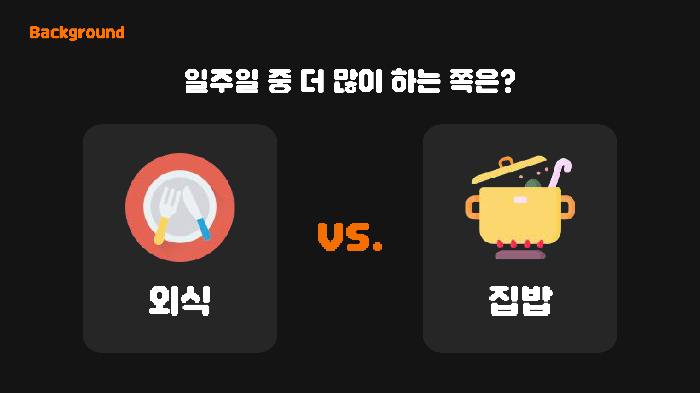
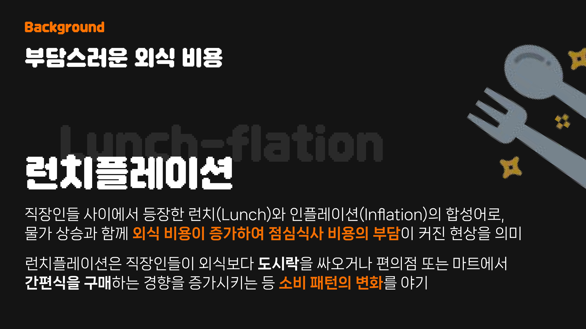
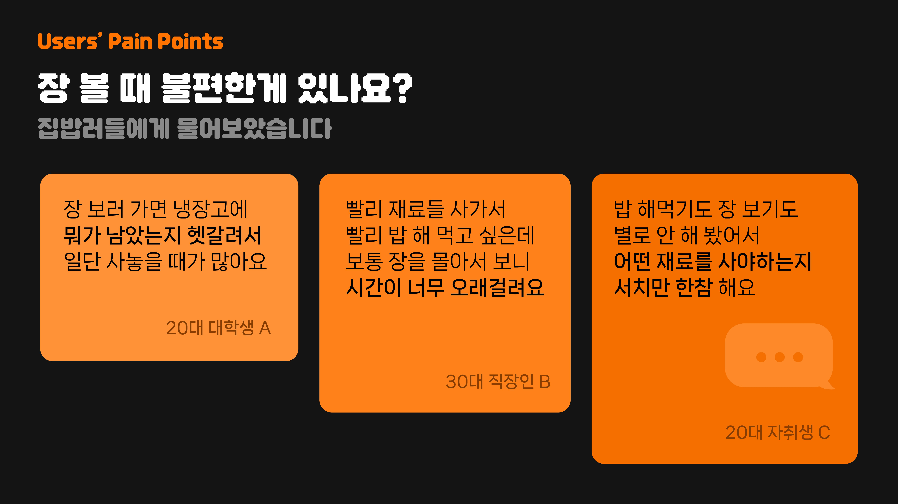
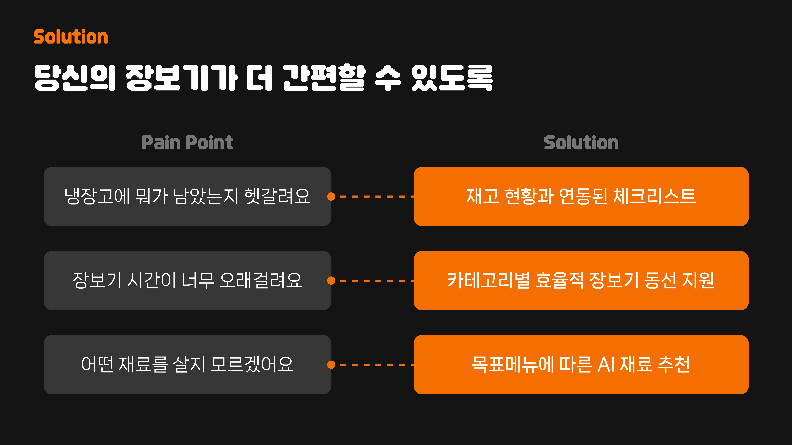
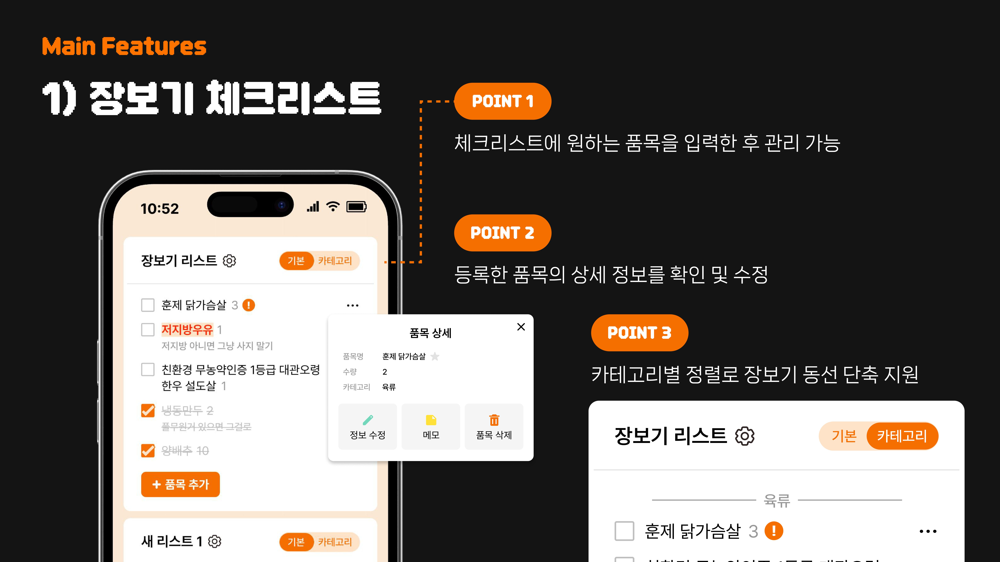
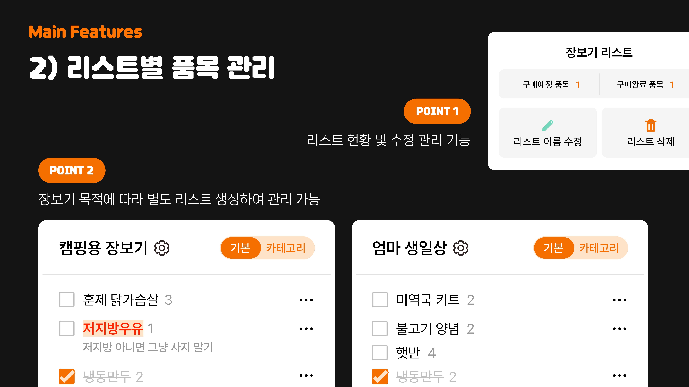

#  바구바구(BGBG)
**바로 구매하는 간편 장보기 체크리스트** 
    

2025.10.09 ~ 2025.11.15 (서비스 종료)
  

  

## ✍️ 프로젝트 개요
- **프로젝트명:** 바구바구
- **프로젝트 개발 기간:** 2025.11.02 ~ 2025.11.14
- **프로젝트 형태:** [멋쟁이사자처럼대학 연합 해커톤] 4호선톤
- **목표:** 런치인플레이션에 따른 외식 비용 부담 증가로 인해 변화하는 소비 패턴을 파악하여 사용자에게 간편한 장보기 환경을 제공합니다.
- **주요 타겟 사용자:** 고물가 시대에 살아가는 1인가구, 집밥을 선호하는 모든 사용자 등

## ✍️ 프로젝트 소개

[📄 4팀 기획자료 다운로드 / 보기](./.github/profile/assets/4팀_기획자료.pdf)

## 🧑‍💻 Team Members
| PM/Design |
|:---:|
| [김민서](https://github.com/danginseo) | 
|  | 

| FE Developer | FE Developer |
|:---:|:---:|
| [구혁모](https://github.com/9hkmo) | [박성훈](https://github.com/parkseonghun598) |
|  |  |

| BE Developer | BE Developer | BE Developer |
|:---:|:---:|:---:|
| [박주용](https://github.com/imjuyongp) | [이가은](https://github.com/egaeuni) | [최서구](https://github.com/choiseogu) |
|  |  |  |

## ⚙️ Tech Stacks
#### Design (UI/UX) 

#### Environment

#### Frontend 

#### Backend

#### AI

#### Communication

  
